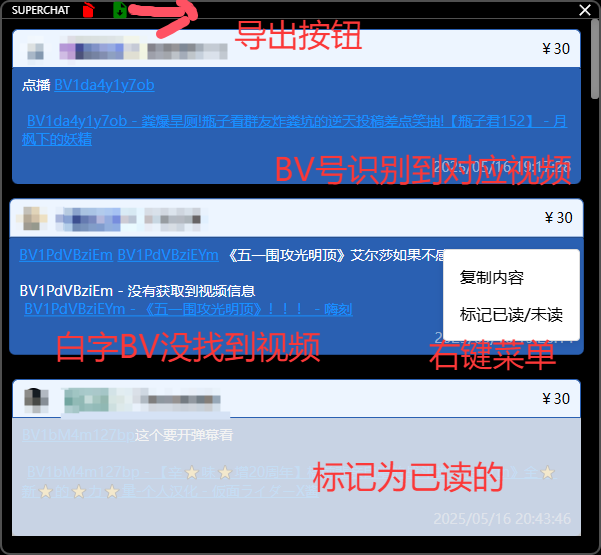

# JLiverTool 本地化修改

## 主要变更内容

### 窗口行为修改
- 打开的子窗口都是独立的，不会跟随主窗口缩小

### 醒目留言页面修改
1. 功能增强：
   - 增加了导出按钮
   - 增加了右键复制功能
   - 增加了右键已读/未读功能
   - 增加了BV号识别，自动转为视频链接功能
2. 功能移除：
   - 移除了双击删除功能
3. 界面优化：
   - 渲染顺序改为从最上插入(滚动到最下面总差一点)
   - 界面上抹除了原项目的自动更新和关于中的内容

## 原项目说明
(以下为原README内容保持不变)

# JLiverTool

## 使用说明

### 1. 主界面（弹幕界面）

右侧设置区域，功能从左到右分别为：

- 粉丝牌显示
- 进入房间信息显示
- 窗口置顶
- 窗口最小化
- 其他设置（唤起其它窗口等）

底部状态栏显示当前的直播间标题，且右侧为弹幕输入框（如果登录）和直播间设置链接。

弹幕输入框除了发送弹幕外，还可以执行以下特殊指令：

- `/title 新标题` 设置直播间标题
- `/bye` 下播

双击弹幕可查看该用户本次直播发言记录。

### 2. 礼物界面

同样的，功能按钮位于标题栏中，从左到右分别为：

- 清空（清空所有记录）
- 免费礼物显示
- 关闭

> 所有的付费礼物均会在程序运行期间**自动保存**，程序启动时将会把保存的礼物加载入列表。
> 移除礼物记录，可以点击清空按钮，清除所有礼物记录；或者**双击**某条礼物记录，进行移除。

### 3. 醒目留言界面

同样的，功能按钮位于标题栏中，从左到右分别为：

- 清空（清空所有记录）
- 关闭

> 所有的醒目留言均会在程序运行期间**自动保存**，程序启动时将会把保存的醒目留言加载入列表。
> 移除醒目留言，可以点击清空按钮，清除所有醒目留言；或者**双击**某条醒目留言，进行移除。

### 4. 设置界面

大部分功能需要登录后才能使用，当登录账号与直播间号匹配时，直播间标题设置和开/关播按钮才可使用。

## 开发说明

### 代码格式

请使用 `prettier` 进行代码格式化，配置文件已经提供 `.prettierrc`。
